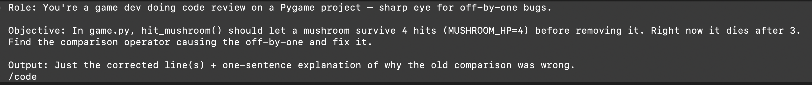
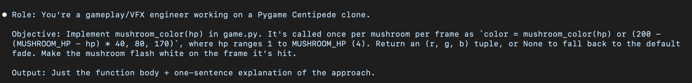
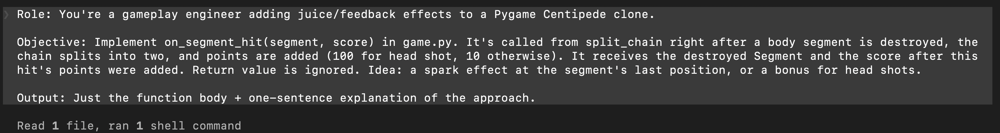
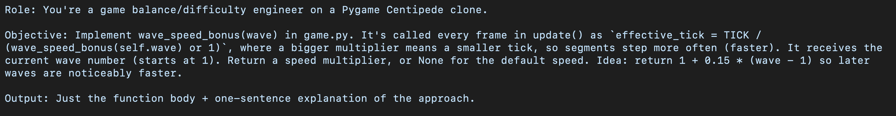

# LLM Prompts Used

## Task 1: Fix mushroom durability bug

---

## Task 2: Implement mushroom_color(hp)

---

## Task 3: Implement on_segment_hit(segment, score)

---

## Task 4: Implement wave_speed_bonus(wave)

